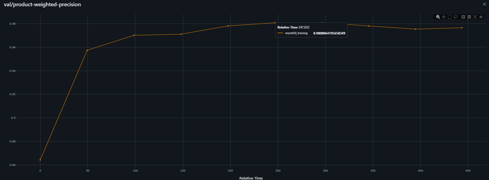
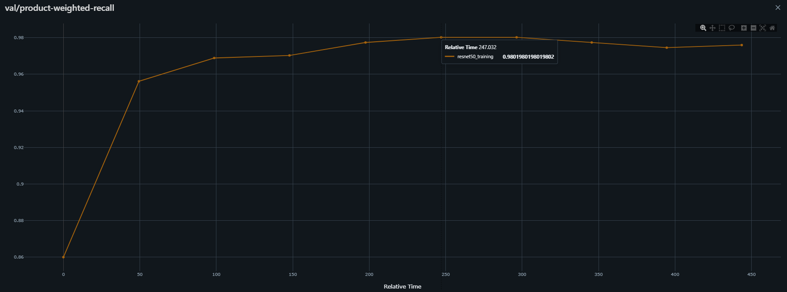
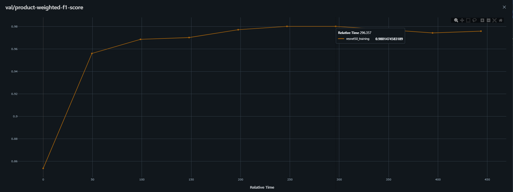
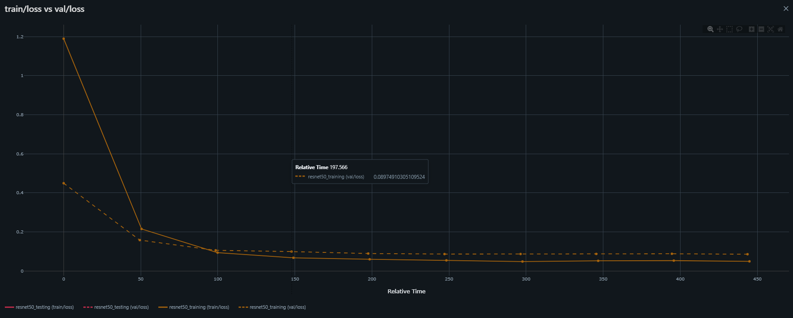

### Retail Product Recognition System

#### 1. Dataset Sources
 - https://universe.roboflow.com/nandine-mrpzn/coke-classification-rbzab/dataset/4
 - https://universe.roboflow.com/python-hrfbj/soda_project
 - https://huggingface.co/datasets/Matthijs/snacks/tree/main
 - https://universe.roboflow.com/daburactivejuice/dabur_activejuice
 
<table>
  <tr>
    <td style="vertical-align: top;">
      <strong>Original Dataset</strong><br>
      
    </td>
    <td style="vertical-align: top;">
      <strong>New Dataset</strong><br>
      
    </td>
  </tr>
</table>


#### 2. Model Information
A ResNet50 model is used to identify the products. The model is trained on 15 retail products accross 3 categories. It is then used to identify the products that are given by the user through the frontend.

Following are the visuzalized examples of the model training metrics:
<table>
  <tr>
    <td style="vertical-align: top;">
      <strong>Precision - 98.08%</strong><br><br>
      
    </td>
  </tr>
  <tr>
    <td style="vertical-align: top;">
      <br><strong>Recall - 98.02%</strong><br><br>
      
    </td>
  </tr>
  <tr>
    <td style="vertical-align: top;">
      <br><strong>F1 Score - 98.01%</strong><br><br>
      
    </td>
  </tr>
  <tr>
    <td style="vertical-align: top;">
      <br><strong>Train v/s Validation Loss</strong><br>
      
    </td>
  </tr>
</table>

#### 3. Frontend
The frontend of the product is being developed using the ReactJS. With a functionality to upload an image and get the top 3 predictions of the image along with the category the product belongs to, the exact product name and the confidence with which the classifications are done. 

#### 4. Backend
The backend of the product is being developed using Python + FastAPI. The endpoint initializes the model and exposes the prediction API to the frontend. Once the user Uploads an image, the frontend relays the image to the backend through the FastAPI and then python handles the product classification. Finally, the backend forwards the predictions to the frontend.

#### 5. API Reference
1. Frontend exposed on - http://localhost:3000
2. Backend exposed on - http://localhost:8000
3. Prediction - http://localhost:3000/predict/ (POST) - to be used through frontend

### 6. Instructions to run the Retail Product Recognition Application
1. An x86_64 machine
2. Make sure you have docker and docker compose installed
3. Clone the repository using following command:
```
git clone <repository_url> 
cd <repository_name>
```
4. Build and run the application using Docker Compose:
```
docker-compose up --build
```
5. Open your browser:
    * Frontend (React): http://localhost:3000
    * Backend (FastAPI): http://localhost:8000
6. Stopping the Project. To stop the project, run:
```
docker-compose down
```

