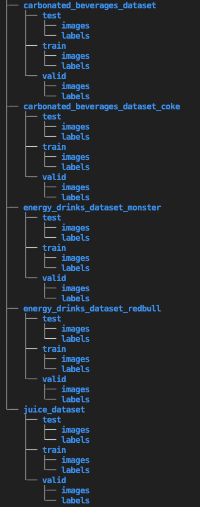
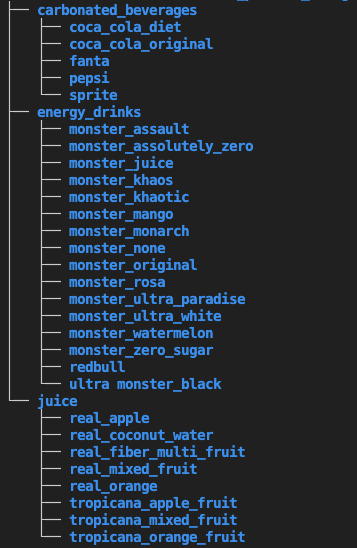

### Retail Product Recognition System

#### 1. Dataset Sources
 - https://universe.roboflow.com/nandine-mrpzn/coke-classification-rbzab/dataset/4
 - https://universe.roboflow.com/python-hrfbj/soda_project
 - https://huggingface.co/datasets/Matthijs/snacks/tree/main
 - https://universe.roboflow.com/daburactivejuice/dabur_activejuice
 
<table>
  <tr>
    <td style="vertical-align: top;">
      <strong>Original Dataset</strong> 
      
    </td>
    <td style="vertical-align: top;">
      <strong>New Dataset</strong> 
      
    </td>
  </tr>
</table>
